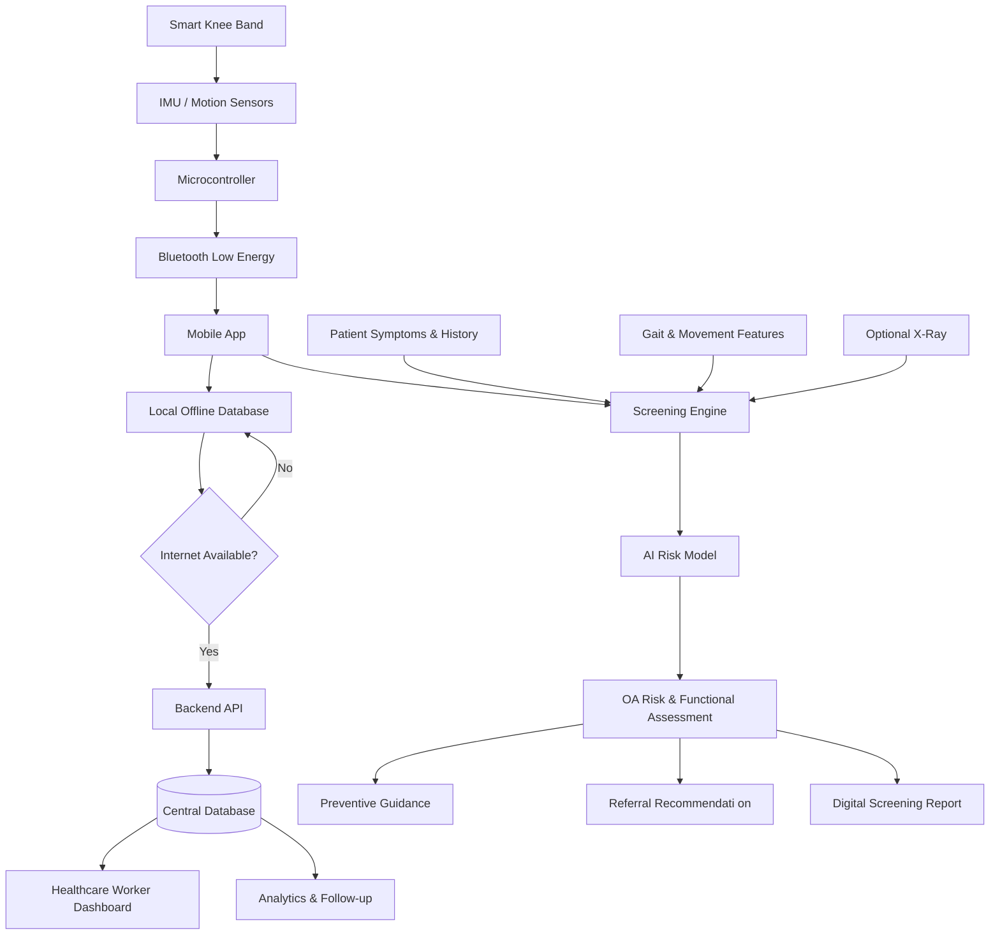

# CREPISENSE — AI-Assisted OA Risk Screening for NER

**SIH 2026 · Problem Statement 26004** · Team DevelopMENTALS (SIH 2026-260)
Ministry of Development of North Eastern Region (MDoNER) · Category: Hardware · Theme: MedTech, Biotech, HealthTech

## What this is

An offline-first, mobile screening tool that flags **osteoarthritis (OA) risk**
(Low / Medium / High) in rural/remote NER using a digitized WOMAC/KOOS
questionnaire plus a phone- (or optional IMU-puck-) based mobility test.

This is a **pre-diagnostic triage layer**, not an X-ray diagnosis tool.
USP: *"screening before diagnosis, not grading after it."*

See `docs/data_schema.md` for the shared data contract all components
build against, and `docs/architecture.md` for the full system design.

## Repo layout

```
sih-oa-screening/
├── mobile_app/          # Flutter app — health worker's main tool (Tier 1)
│   └── lib/
│       ├── models/        # Patient, Screening, RiskResult data classes
│       ├── screens/       # Intake, Questionnaire, Mobility Test, Results
│       └── services/      # local DB (sqflite), ML inference, Firebase sync
├── ml_model/             # scikit-learn training → TensorFlow Lite export
│   └── data/               # training data (synthetic to start)
├── web_dashboard/        # React + Chart.js — district/MDoNER admin view
│   └── src/
│       ├── components/
│       ├── pages/
│       └── services/
├── hardware_firmware/    # ESP32 IMU-puck firmware (Tier 3 / roadmap)
└── docs/                 # schema, architecture, tiering, walkthrough
```

## Build tiers

| Tier | Status | Scope |
|------|--------|-------|
| 1 | Core (build first) | Intake, questionnaire, on-device risk scoring, offline SQLite storage, patient history |
| 2 | Prototype | Multilingual UI, phone-IMU mobility test, web dashboard, Firebase sync |
| 3 | Roadmap only | Dedicated ESP32+IMU hardware puck, GIS/Bhuvan heatmapping, X-ray module, end-to-end encryption |

## Stack

- **Mobile:** Flutter (Dart), sqflite, flutter_localizations, TFLite inference
- **ML:** scikit-learn → TensorFlow Lite
- **Backend/sync:** Firebase Firestore + Auth
- **Dashboard:** React + Chart.js
- **Optional hardware:** ESP32-class MCU + IMU (accel + gyro) + BLE

## Getting started

Each subfolder is scaffolded but empty — implementation happens in your IDE.
Suggested order: `docs/data_schema.md` → `ml_model/` → `mobile_app/` → `web_dashboard/`.
#


## System Architecture



---
